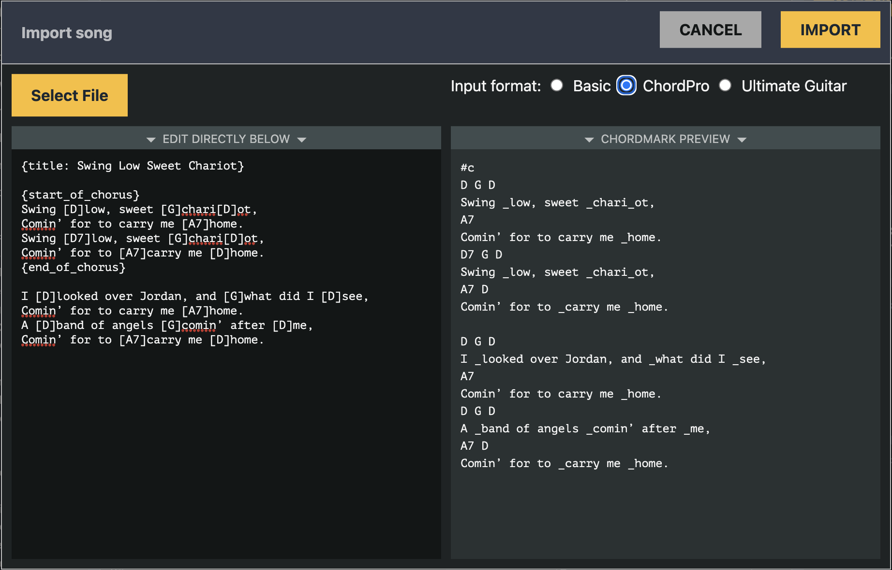

import { CM, CCS, CS } from '../../src/components/shortcuts';
import TabbedChordMark from '../../src/components/TabbedChordMark';

# Importing songs

## The import dialog

Hitting the **Import** button will bring the following dialog:

Importing songs can be done:

- by copy/pasting content in the input box on the left side (typically a chord chart that you will find on another website)
- by selecting a file on your hard drive, for example, a ChordPro file 

The right side of the import dialog will show a preview of the input converted in the <CM/> format.
If the conversion doesn't look right, you can adjust the input format:

- **Basic**: should work for most chord charts where the chord symbols are positioned over the lyrics, which is the standard way of rendering chord charts in most websites
- **ChordPro**: use this setting if the input source is in the [ChordPro](https://www.chordpro.org/) format, eg, with chords encoded between square brackets directly in the lyrics
- **Ultimate Guitar**: very similar to **Basic**, but also recognize some of the specific syntax used by chord charts on the [Ultimate Guitar](https://www.ultimate-guitar.com/) website.

Of course, recognizing if the conversion "looks right" or not requires a bit of practice with the <CM/> format.

This import functionality heavily relies on the excellent [ChordSheetJS](https://github.com/martijnversluis/ChordSheetJS/) library. 

Once you are happy with the settings, hit the **IMPORT** button in the top right corner. 

## Encoding rhythm information

Since <CM/> is the only chord chart format that encodes rhythm information, you will need to add this information manually to each chord symbol after importing a song.
There are three possibilities, depending on the duration of a chord:

### Exactly one bar

Lucky you! There is nothing specific to do here, since by default, <CM/> will interpret a chord symbol as lasting a full bar. 

<TabbedChordMark src={'A E\n_By default, all chords _lasts a full bar'} />

### Less than one bar

Use the chord duration marker `.` to specify how many beats the chord should be played.
You might also need to specify the song time signature if different than 4/4.

<TabbedChordMark src={'5/4\nA... D. E.\n_Three chords in a _single 5/4 _bar'} />

### More than one bar

A bit of extra work is needed here. 
You need to repeat the chord as many times as it should be played for the duration of a full bar.
Use the bar repeat symbol `%` to make that process quicker. 
For a better result, chord position markers should also be repeated in the lyric line.

<TabbedChordMark src={'A %%\n_The same chord _over multiple bars _need to be repeated'} />
