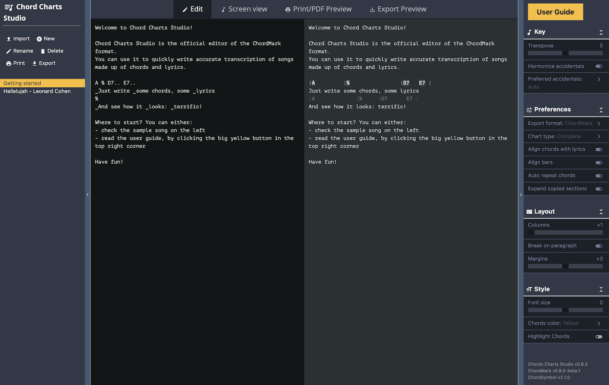

import { CM, CCS, CS } from '../../src/components/shortcuts';

# Overview

Chord Charts Studio is the official editor of <CM />: it is [freely available online](http://chord-charts-studio.netlify.app).

It is currently the only editor that allows creating and formatting songs in the <CM /> format.
Since <CM /> is an Open Source project, more software might start implementing it in the future.

The primary user interface is made of four parts:

- the "song manager" on the left
- the "Mode switcher" at the top
- the main area
- the options panel on the right

## The Song manager

The song manager offers the following functionality:

- **Import**: creates a new song from an external source/format, typically from a file or another website, and convert it to <CM />
- **New**: creates a new song from scratch in the <CM/> format
- **Rename**: allows renaming the currently selected song. You can also double-click on the song title directly.
- **Delete**: allows deleting the currently selected song (needs confirmation)
- **Print**: switches to the **Print/PDF Preview** mode and display the browser printing dialog
- **Export**: switches to the **Export Preview** mode and display the browser file saving dialog

To switch from one song to another, click on a title in the song list below the actions buttons.

## Main area & the mode switcher

When a song is selected, it will be displayed in the main area and adapt to the selected mode:

- **Edit**: this is where the actual writing of the chord chart takes place. 
You write on the left pane, and the right pane will show you in real-time the final output.
Of course, the chord chart needs to follow [the ChordMark syntax](/docs/getting-started).
- **Screen view**: this mode is helpful if you wish to play the song by directly looking at your computer screen.
You can format the chord chart such as it nicely fits the screen real estate, and you don't need to scroll when playing (for example, using multiple columns).
To further increase the screen real estate, you can fold both the right and left sidebars.
- **Print/PDF Preview**: this mode shows you a preview of how the song will look when printed on an A4 paper or exported as a PDF. 
Here again, you can tweak the settings such as the song fits on a single sheet of paper (or as many as you want): number of columns, font size, etc.
- **Export Preview**: finally, this mode allows you to prepare the chord chart for being exported as a text file. A ChordPro export is available.

It is important to stress that all formatting options are not available in all modes: 
for example, text documents do not support columns, so the columns setting is not available in the **Export Preview** mode.

Equally important, when an option is available in more than one mode, then it is saved for the current mode only, independently of the others. 
In other words, you can have a setting of 4 columns for the screen view and two columns for the printed one, for example.
The "Key" settings, however, are set once for all the modes.

## The options panel

The song display can be customized with the following options:

### Editor preferences

These options apply to all Chord Charts.

- **Theme**: Theme for ChordMark rendering, both in Editor preview and in the screen view
- **Export format**: 
    - **ChordMark**: format the song using the <CM/> rendering
    - **ChordMark (Source)**: use this setting to export the song in the source <CM/> format
    - **ChordPro**: convert the song in the ChordPro format (beta)

### Key

These options apply to all rendering modes of a single Chord Chart.

- **Transpose**: use this slider to transpose up or down the chords
- **Harmonize accidentals**: enable this option if you want all chords symbols to be rendered with the same accidentals
- **Preferred accidentals**: only available if the previous option is turned on
    - **Auto**: the accidental with the most occurrences in the song will be used 
    - **#**: render all accidentals with sharps
    - **b**: render all accidentals with flats
    
### Preferences

These options apply only to a given rendering mode of a Chord Chart.

- **Chart Type**:
    - **Complete**: renders everything
    - **Lyrics only**: hide the chords
    - **Chords only**: hide the lyrics
    - **Chords + First lyric line**: display only the first lyric line of each section. Useful if you only need a quick reminder of the lyrics.
- **Align chords with lyrics**: use the chord position markers in the lyric line to position the chords symbols above the lyrics
- **Align bars**: align the chord symbols and the bar separators of all chord lines. This setting has no effect on chords symbols that are aligned with lyrics
- **Auto repeat chords**: automatically repeat chords for identical sections (verse, chorus...).
- **Expand copied sections**: when you repeat a section by using its label (`#c`, for ex), 
use this setting to decide if only the section title should be printed or if the full section should be copied

### Layout

These options are only available in Screen view and Print Preview modes.

- **Font size**: adjust the size of the text
- **Columns**: display the song over multiple columns
- **Column break on section**: avoid splitting a section in two different columns when printing a song
- **Margins**: adjust the document margins when printing a song

